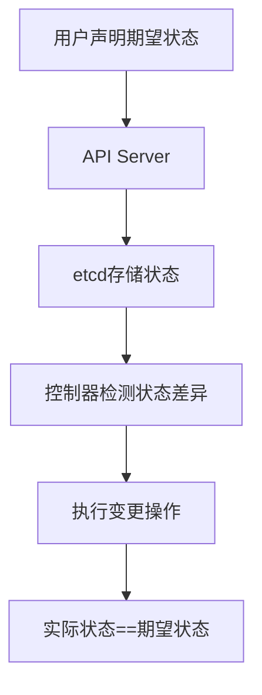
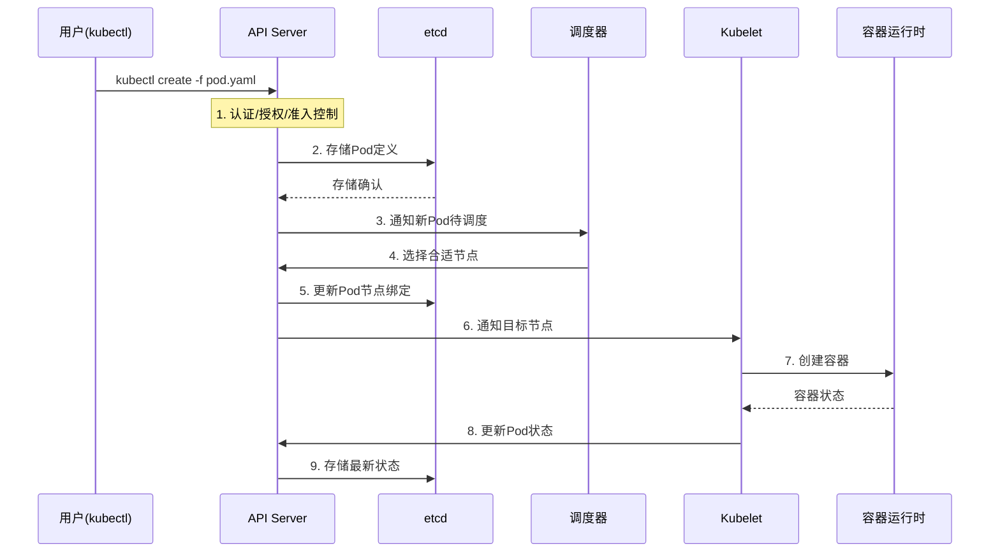
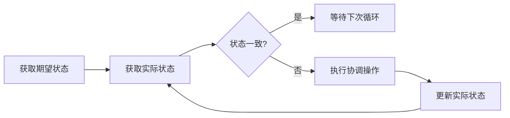
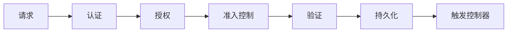
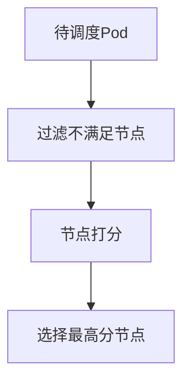
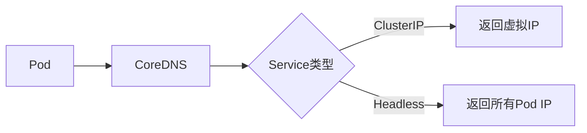
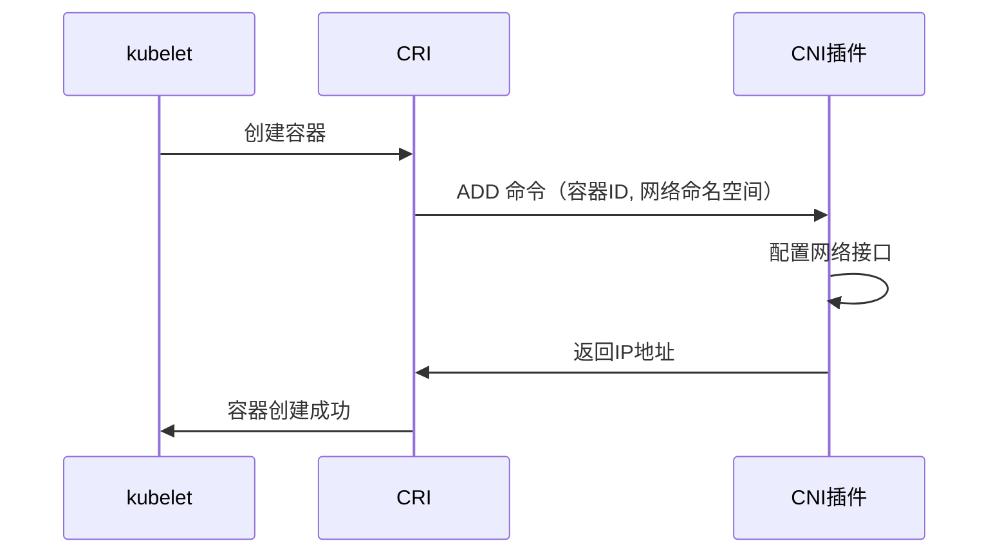
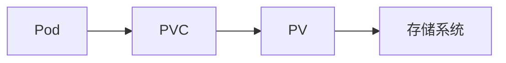
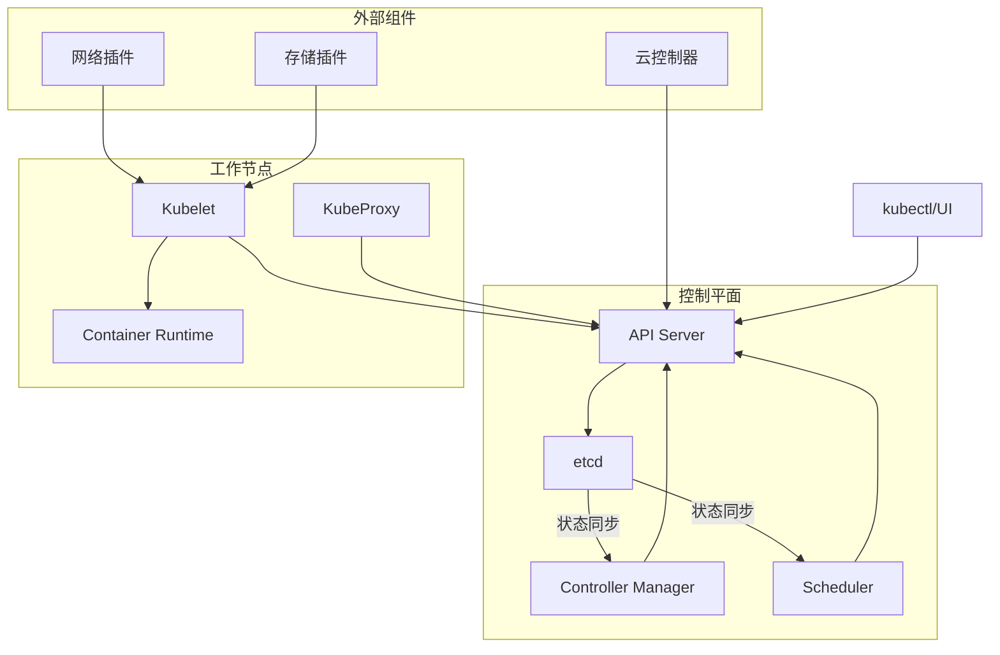

## 一、Kubernetes 核心设计哲学

Kubernetes 基于几个核心设计原则构建：
1. **声明式系统**：用户描述期望状态，系统自动实现并维持该状态
2. **控制器模式**：通过控制循环持续检测并修复状态偏差
3. **解耦设计**：组件间通过 API 松耦合，可独立升级替换
4. **自愈能力**：自动检测并替换不健康组件



## 二、核心组件协作流程

### 1. 请求处理全流程（以创建 Pod 为例）



### 2. 关键步骤详解：
1. **API 请求处理**：认证、授权、准入控制三阶段验证
2. **状态存储**：所有对象状态持久化到 etcd
3. **调度决策**：调度器基于资源需求、亲和性等策略选择节点
4. **节点绑定**：更新 Pod 的 nodeName 字段
5. **容器创建**：Kubelet 通过 CRI 接口调用容器运行时
6. **状态同步**：Kubelet 持续报告容器状态到控制平面

## 三、核心工作机制深度剖析

### 1. 控制器模式（Control Loop）



- **工作流程**：
  1. 从 API Server 读取期望状态
  2. 观察系统实际状态
  3. 比较状态差异
  4. 执行操作消除差异
  5. 定期重复上述过程（通常每秒执行）

- **典型控制器**：
  - Deployment 控制器：管理 ReplicaSet
  - ReplicaSet 控制器：确保 Pod 副本数
  - Node 控制器：监控节点状态
  - Endpoint 控制器：维护 Service 与 Pod 映射

### 2. etcd 的核心作用
- **分布式键值存储**：保存所有集群状态数据
- **Watch 机制**：组件监听资源变更
- **事务支持**：确保多对象更新的原子性
- **租约机制**：实现组件活性检测（如 kubelet 心跳）

### 3. API Server 的多层处理机制



- **认证层**：客户端证书、Bearer Token、Basic Auth 等
- **授权层**：RBAC、ABAC、Node 授权等
- **准入控制**：Mutating（修改请求）和 Validating（验证请求）Webhook
- **资源版本控制**：乐观锁（ResourceVersion 字段）

## 四、核心子系统工作原理

### 1. 调度系统

**调度流程：**


- **过滤阶段**：排除不满足条件的节点（资源不足、端口冲突等）
- **打分阶段**：根据策略计算节点得分（资源平衡、亲和性等）
- **绑定操作**：异步执行节点绑定

**高级调度特性：**
- 节点亲和性/反亲和性
- Pod 亲和性/反亲和性
- 污点与容忍
- 自定义调度器

### 2. 服务发现与负载均衡

**DNS 解析流程：**


- **kube-proxy 工作模式**：
  - iptables：默认模式，高性能
  - IPVS：大规模集群推荐
  - userspace：旧模式，基本弃用

- **Endpoint Controller**：实时维护 Service 与 Pod IP 映射

### 3. 网络模型实现

**Pod 网络原则：**
1. 每个 Pod 拥有唯一 IP（IP-per-Pod）
2. Pod 跨节点直接通信（无 NAT）
3. 节点可访问所有 Pod（无 NAT）

**CNI 插件工作流程：**


### 4. 存储系统

**持久卷工作流程：**


- **动态供应**：StorageClass + Provisioner
- **卷类型**：
  - 本地存储（Local）
  - 网络存储（NFS, iSCSI）
  - 云存储（AWS EBS, GCP PD）
  - 分布式存储（Ceph, GlusterFS）

- **卷生命周期**：
  1. Provisioning（供应）
  2. Binding（绑定）
  3. Using（使用）
  4. Reclaiming（回收）

## 五、自我修复机制

### 1. 健康检查体系
```yaml
livenessProbe:   # 检测应用是否存活
  httpGet:
    path: /healthz
    port: 8080
  initialDelaySeconds: 15
  periodSeconds: 20

readinessProbe:  # 检测应用是否就绪
  tcpSocket:
    port: 3306
  initialDelaySeconds: 5
  periodSeconds: 10
```

### 2. 故障恢复场景
| 故障类型       | 恢复机制                             | 负责组件        |
|----------------|--------------------------------------|----------------|
| **Pod 崩溃**   | 重启容器（根据重启策略）             | kubelet        |
| **节点宕机**   | 重新调度受影响 Pod                   | 节点控制器     |
| **应用无响应** | 根据存活探针重启容器                 | kubelet        |
| **网络分区**   | 节点状态标记为 NotReady              | 节点控制器     |
| **控制平面故障**| 高可用组件自动接管                   | API Server 集群|

## 六、扩展机制

### 1. CRD（Custom Resource Definitions）
```yaml
apiVersion: apiextensions.k8s.io/v1
kind: CustomResourceDefinition
metadata:
  name: myresources.example.com
spec:
  group: example.com
  names:
    kind: MyResource
    plural: myresources
  scope: Namespaced
  versions:
    - name: v1
      served: true
      storage: true
```

### 2. 控制器模式扩展
```go
func (c *Controller) Run(stopCh <-chan struct{}) {
    // 1. 初始化缓存
    // 2. 启动工作队列
    // 3. 启动Worker处理
    for i := 0; i < workers; i++ {
        go wait.Until(c.worker, time.Second, stopCh)
    }
    <-stopCh
}

func (c *Controller) worker() {
    for c.processNextItem() {}
}
```

### 3. 扩展点架构
| 扩展类型         | 实现方式                  | 典型用例                  |
|------------------|---------------------------|---------------------------|
| **网络**         | CNI 插件                  | Calico, Flannel           |
| **存储**         | CSI 驱动                  | AWS EBS, GCP PD           |
| **设备**         | Device 插件               | GPU 支持                  |
| **调度**         | 调度器扩展                | 自定义调度策略            |
| **运行时**       | CRI 实现                  | containerd, CRI-O         |
| **认证/授权**    | Webhook                   | 企业SSO集成               |

## 七、集群运作全景图



## 八、Kubernetes 设计精髓总结

1. **声明式API**：用户关注"做什么"而非"怎么做"
2. **控制器模式**：持续协调使系统趋近期望状态
3. **松耦合架构**：组件通过API交互，独立演进
4. **扩展优先**：通过CRD和插件支持各种场景
5. **自愈能力**：自动检测和修复异常状态
6. **统一抽象**：跨基础设施提供一致接口

Kubernetes 通过这套精妙的设计，将复杂的分布式系统管理简化为声明式配置，同时保持了足够的灵活性和扩展性，成为云原生时代的操作系统级平台。理解这些底层原理，有助于更高效地使用和运维Kubernetes集群。